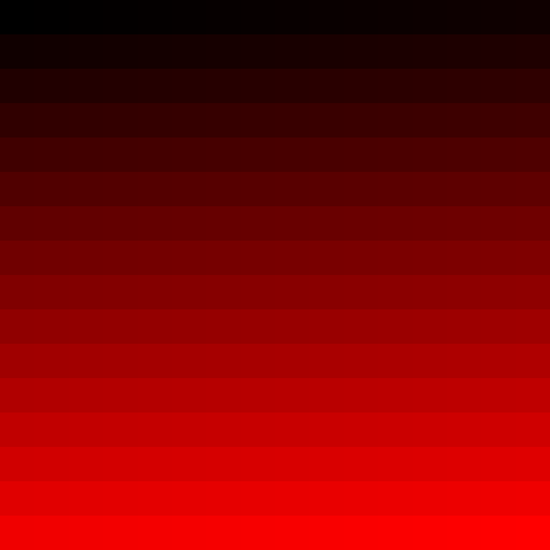
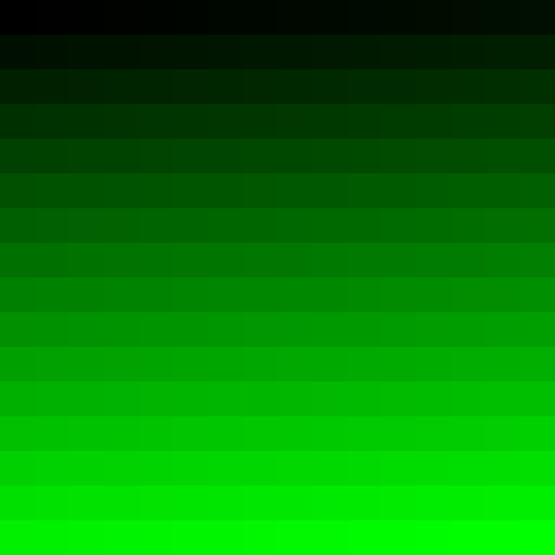
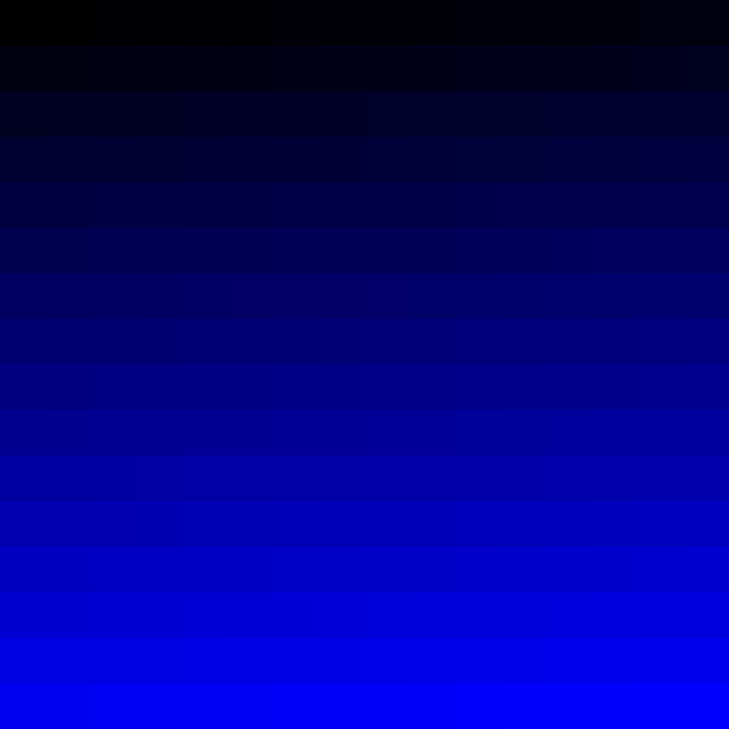
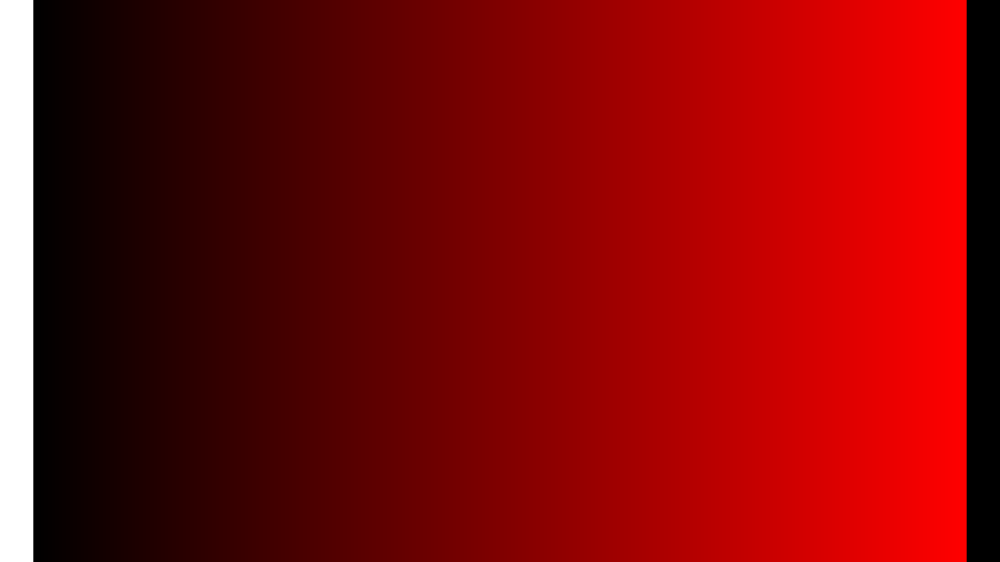
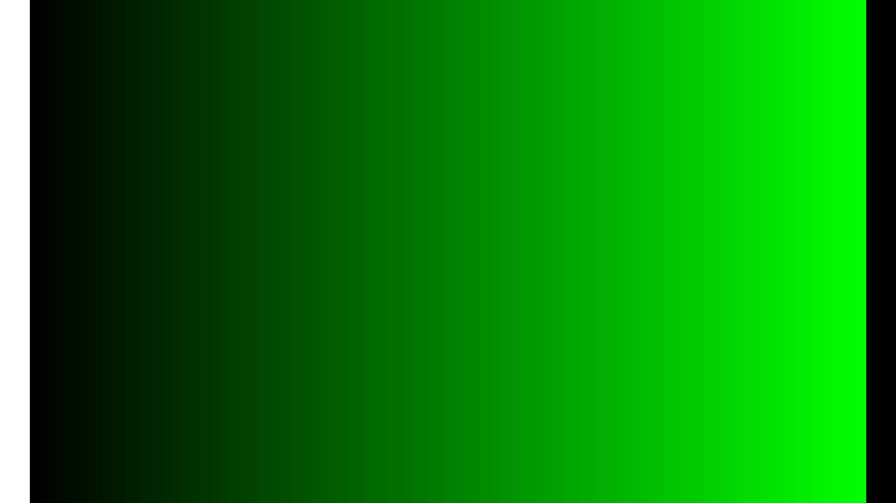
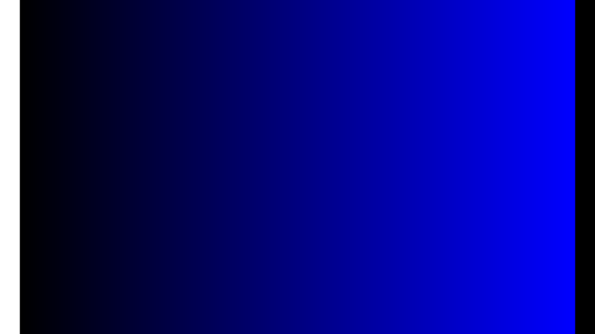
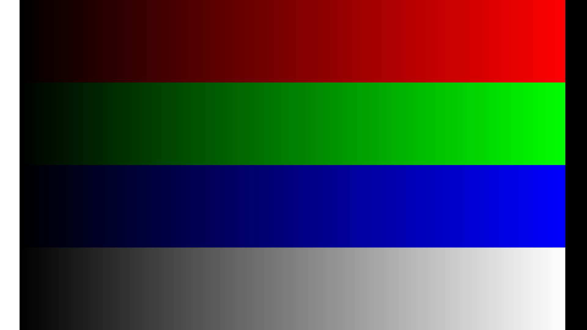

## ディレクトリの説明
src: SVG画像を生成するためのソースコード(C++)
svg_out: 生成したSVGファイル
png: SVGをPNGに変換したもの。(変換にはInkscapeを用いた)

## Color Chart
3原色(RGB)それぞれについて、0~255の256色を16x16のマトリクスに収めたものを描画する。

### サンプル画像(png)
赤(RED)

緑(GREEN)

青(BLUE)

## Gradation
3原色(RGB)それぞれについて、0~255の256色のグラデーションを描画する。
FullHDサイズ(1920x1080)で、各色7px幅の長方形で描画している。
ただし、左端64pxは白(`#ffffff`)、 右端64pxは黒(`#000000`)である。
(64 + 7 * 256 + 64 = 1920)

### サンプル画像(png)
赤(RED)

緑(GREEN)

青(BLUE)

赤緑青、及び無色

